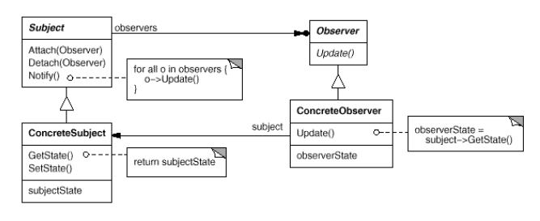

#h3 Goal
The goal of this project is to create a library of design patterns to use everyday in real projects.
The pattern should require minimal code to be used.
#h3 Standard for new commits
Be sure that
1. code is validated against the specification defined in the book Design Patterns: Elements of Reusable Object-Oriented Software" 
2. all the tests are always green and cover all the features 
3. all code is pep-8, validated using flake-8 (black)  
4. TODO code annotations and typing validated  
5. Code is commented when needed 

#h3 Documentation
1. Class Diagrams 
1.1. Observer Pattern Class Diagram 
img src=
