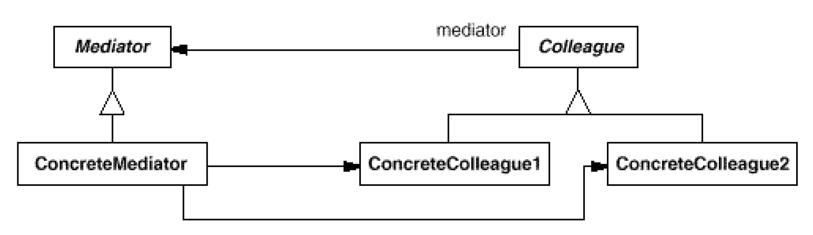

# Goal
The goal of this project is to create a library of design patterns to use everyday in real projects.
The pattern should require minimal code to be used.
# Standard for new commits
Be sure that
1. code is validated against the specification defined in the book Design Patterns: Elements of Reusable Object-Oriented Software" 
2. all the tests are always green and cover all the features 
3. all code is pep-8, validated using flake-8 (black)  
4. TODO code annotations and typing validated  
5. Code is commented when needed 

# Documentation
## Class Diagrams 
### Creational
* Abstract Factory

* Builder

* Factory Method

* Singleton

* Prototype

### Structural
* Adapter

* Bridge

* Composite

* Decorator

* Facade

* Flyweight

* Proxy

### Behavioural
* Chain Of Responsibility

* Interpreter

* Iterator

* Mediator

* Memento

* Observer

* State

* Strategy

* template method

* visitor

