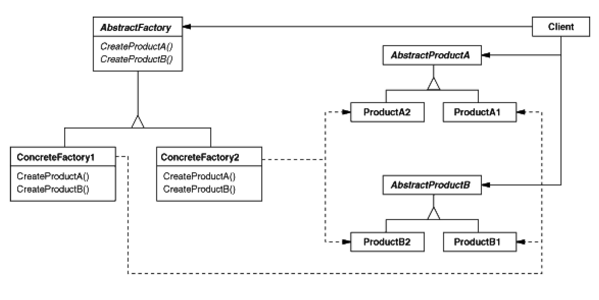

# Goal
The goal of this project is to create a library of design patterns to use everyday in real projects.
The pattern should require minimal code to be used.
# Standard for new commits
Be sure that
1. code is validated against the specification defined in the book Design Patterns: Elements of Reusable Object-Oriented Software" 
2. all the tests are always green and cover all the features 
3. all code is pep-8, validated using flake-8 (black)  
4. TODO code annotations and typing validated  
5. Code is commented when needed 

# Documentation
## Class Diagrams 
### Creational
* Abstract Factory
img src=
* Builder
img src=
* Factory Method
img src=
* Singleton
img src=
* Prototype
img src=
### Structural
* Adapter
img src=
* Bridge
img src=
* Composite
img src=
* Decorator
img src=
* Facade
img src=
* Flyweight
img src=
* Proxy
img src=

### Behavioural
* Chain Of Responsibility
img src=
* Interpreter
img src=
* Iterator
img src=
* Mediator
img src=
* Memento
img src=
* Observer
img src=
* State
img src=
* Strategy
img src=
* template method
img src=
* visitor
img src=

